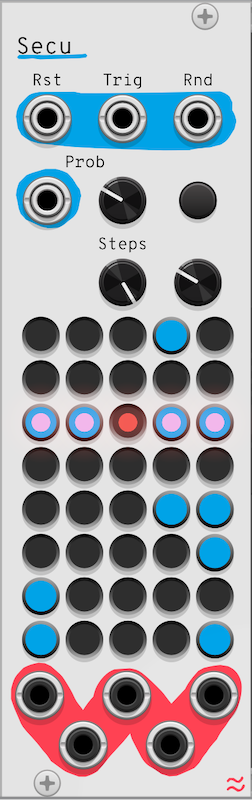
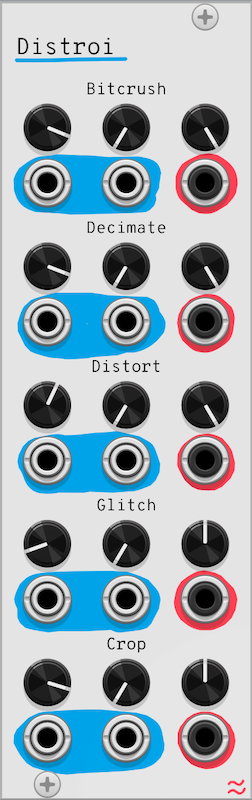

# Ondas
Ondas is a series of free, open-source modules for VCV rack. It includes BaBum (drum synth), Klok (modulo subdivision clock), Secu (probabilistic sequencer), Scener (scene manager), and Distroi (signal corruption effects).

By Sergio Rodríguez Gómez

## Table of Contents

- [Ondas](#ondas)
  - [Table of Contents](#table-of-contents)
  - [Klok](#klok)
    - [Description](#description)
    - [Parameters](#parameters)
    - [Inputs](#inputs)
    - [Outputs](#outputs)
  - [BaBum](#babum)
    - [Description](#description-1)
    - [Parameters](#parameters-1)
    - [Inputs](#inputs-1)
    - [Outputs](#outputs-1)
  - [Secu](#secu)
    - [Description](#description-2)
    - [Parameters](#parameters-2)
    - [Inputs](#inputs-2)
    - [Outputs](#outputs-2)
  - [Scener](#scener)
    - [Description](#description-3)
    - [Parameters](#parameters-3)
    - [Inputs](#inputs-3)
    - [Outputs](#outputs-3)
  - [Distroi](#distroi)
    - [Description](#description-4)
    - [Parameters (Per Effect)](#parameters-per-effect)
    - [Inputs](#inputs-4)
    - [Outputs](#outputs-4)
  - [Suggestions for combining Modules](#suggestions-for-combining-modules)
  - [Attribution and License](#attribution-and-license)

## Klok
Clock generator with modulo outputs

  

### Description
Klok generates a master clock signal with reset functionality and 8 modulo outputs for rhythmic divisions. Ideal for syncing sequencers, drum modules, or modulation sources. Drive sequencers like Secu or drum modules like BaBum. Create polyrhythms by combining multiple modulo outputs.

### Parameters
- Tempo: Adjust BPM (30–360).
- Run: Start/stop the clock.

### Inputs
- Reset Input: Resets the clock to step 0.

### Outputs
- Reset Output: Sends a pulse on reset.
- Modulo Outputs (0–7): Outputs triggers at divisions of the main clock (0 index based, e.g., Modulo 3 triggers every 4th beat).

## BaBum
Drum Synthesizer

  

### Description
BaBum is a 5-part drum synthesizer featuring Kick (BD), Snare (SNR), Closed HiHat (HH), Open HiHat (HHO), and FX sounds. Each part includes customizable tuning, envelope shaping, distortion, and individual outputs. A mix output combines all signals with adjustable levels. Use sequencers (e.g., Secu) to trigger patterns.

### Parameters
- Tune (BD/SNR/FX): Adjust pitch of the drum.
- HiHat HP Filter (HH/HHO): Controls high-pass filter cutoff for noise-based HiHats.
- Length (BD/SNR/HH/HHO/FX): Sets decay time for each sound.
- Distortion (BD/SNR/FX): Adds harmonic saturation.
- Trigger (Buttons): Manually trigger each drum sound.
- Mix (Knobs): Adjust individual levels for the mix output.

### Inputs
- Trigger Inputs (BD/SNR/HH/HHO/FX): Gate/CV inputs to trigger sounds.
- Tune CV Inputs (BD/SNR/HH/FX): Modulate tuning parameters.

### Outputs
- Individual Outputs (BD/SNR/HH/HHO/FX): Direct outputs for each drum sound.
- Mix Output: Combined signal with level control.

## Secu
Step sequencer with probability & randomization

  

### Description
Secu is a 5-channel, 8-step sequencer with per-step gates, randomization, and probability-based step jumping. Pair with Klok for tempo-synced sequences. Control drum modules like BaBum or modulate effects in Distroi.

### Parameters
- Steps: Set sequence length (1–8 steps).
- Probability: Chance to skip steps or jump randomly.
- Randomize: Randomizes step gates with adjustable sparseness.
- Step Buttons: Toggle gates for each channel and step.

### Inputs
- Trigger: Advances the sequence.
- Reset: Resets to step 0.
- Randomize CV: Randomizes gates on trigger.
- Probability CV: Modulates step-skipping chance.

### Outputs
- Trigger Outputs (1–5): Gate signals for each channel.

## Scener
Scene-based channel mixer

  

### Description
Scener manages 6 scenes with 5 input/output channels each, allowing crossfaded transitions between scenes. Includes alerts for triggering events at specific steps. Build song structures by switching between scenes. Use alerts to synchronize effects (e.g., Distroi glitches) with scene changes.

### Parameters
- Scenes: Select active scene count (1–6).
- Steps per Scene: Define duration for each scene.
- Transition Time: Adjust crossfade duration between scenes.
- Loop: Toggle looping.

### Inputs
- Trigger: Advances scenes.
- Reset: Returns to scene 0.
- Signal Inputs (30): 5 channels × 6 scenes.

### Outputs
- Signal Outputs (5): Crossfaded signals from active scenes.
- Alert Outputs (2): Triggers at user-defined step thresholds.

## Distroi
Multi-effect signal corruptor

  

### Description
Distroi applies five destructive effects:

- Bitcrush: Reduces bit depth.
- Decimate: Downsamples the signal.
- Distort: Waveshaping saturation.
- Glitch: Buffer-based stutters.
- Crop: Abrupt signal silencing of signal fragments.

Degrade drums from BaBum for lofi textures. Glitch sequenced patterns from Secu. Process entire mixes from Scener for chaotic transitions.

### Parameters (Per Effect)
- Quantity: Effect intensity.
- CV Attenuation: Modulate "Quantity" via CV.
- Dry/Wet: Blend between original and processed signals.

### Inputs
- Inputs (5): Incoming signal. One per effect.
- CV Inputs (5): Modulate effect parameters.

### Outputs
Outputs (5): Processed signals.

## Suggestions for combining Modules
Clock-Driven Workflow:

Klok → Secu → BaBum → Scener → Distroi
Example: Klok clocks Secu to sequence BaBum drums. Scener crossfades between drum patterns, and Distroi adds glitches to the mix.

Live Performance:
Use Scener to switch between pre-configured scenes, with Distroi adding real-time effects triggered by Secu’s probability-based gates.

Experimental Sound Design:
Process BaBum’s FX output through Distroi’s bitcrush and glitch effects, modulated by Klok’s modulo outputs.

## Attribution and License

By Sergio Rodríguez Gómez - 2025
MIT LICENSE

